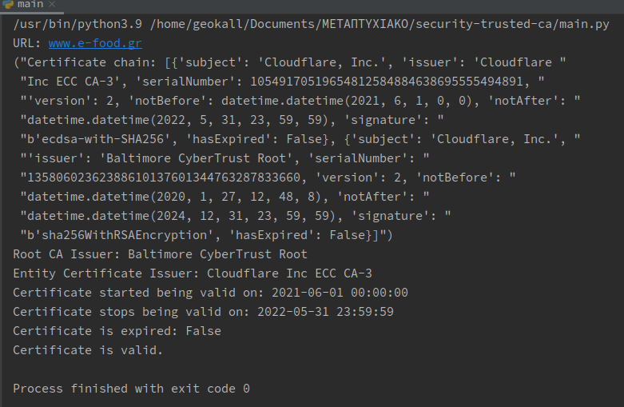
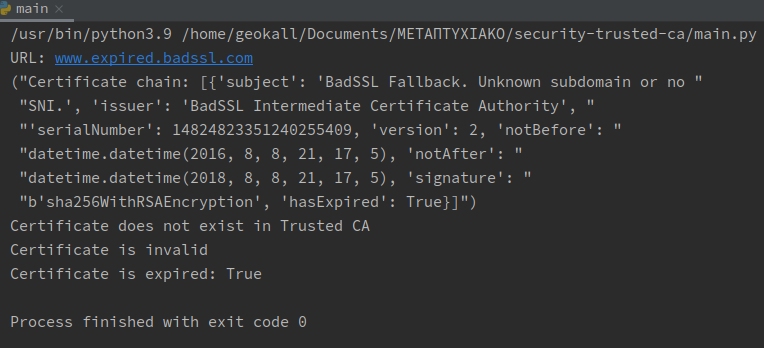

# SSL chain of trust - Certificate validation

## HTTPS

Hypertext Transfer Protocol Secure (HTTPS) is an extension of the Hypertext Transfer Protocol (HTTP). It is used for
secure communication over a computer network, and is widely used on the Internet.
In HTTPS, the communication protocol is encrypted using Transport Layer Security (TLS) or, formerly, Secure Sockets
Layer (SSL). The protocol is therefore also referred to as HTTP over TLS, or HTTP over SSL.

The principal motivations for HTTPS are authentication of the accessed website, and protection of the privacy and integrity of the exchanged data
while in transit. It protects against man-in-the-middle attacks, and the bidirectional encryption of communications
between a client and server protects the communications against eavesdropping and tampering. The authentication
aspect of HTTPS requires a trusted third party to sign server-side digital certificates.

## TLS

Transport Layer Security (TLS) encrypts data sent over the Internet to ensure that eavesdroppers and hackers are unable
to see what you transmit which is particularly useful for private and sensitive information such as passwords, credit
card numbers, <br />
and personal correspondence. TLS is normally implemented on top of TCP in order to encrypt Application Layer protocols
such as HTTP, FTP, SMTP and IMAP, <br />
although it can also be implemented on UDP, DHCP and SCTP as well (e.g. for VPN and SIP-based application uses).

## X.509 Certificate

An X.509 certificate is a digital certificate based on the widely accepted International Telecommunications Union (ITU)
X.509 standard, which defines the format of public key infrastructure (PKI) certificates. They are used to managing
identity and security in internet communications and computer networking. They are unobtrusive and ubiquitous, and we
encounter them every day when using websites, mobile apps, online documents, and connected devices.

## CA

A Certificate Authority (CA) is an entity that issues digital certificates conforming to the ITU-T’s X.509
standard <br />
for Public Key Infrastructures (PKIs). Digital certificates certify the public key of the owner of the
certificate <br />
(known as the subject), and that the owner controls the domain being secured by the certificate.

Based on [Root certificate](https://en.wikipedia.org/wiki/Root_certificate) in order to validate the certificate from an
url <br />
we need to verify X509 Certificate chain of trust.


## Design - Implementation

The first step is to retrieve X509 instances (SSL chain of trust). To do that, an SSL context is initialized. In this
context <br />
is loaded the ca-bundle.crt, using the ```certifi.where()``` method. <br />

```python
context.load_verify_locations(cafile=certifi.where())
```

```python
conn.get_peer_cert_chain()
```

Above function fetches the instances. The first element is the url's certificate and the last element the root
ca. <br />
In the next step, an object with all the attributes is created and appended in a list. <br />

For the subject, keeping only the 'O'(organization) and for the issuer the 'CN' (common name). <br />
Another useful attribute is the 'hasExpired', which provides us the information if the certificate is expired.
<br />
```python
certificate_info = {
    'subject': cert.get_subject().O,
    'issuer': cert.get_issuer().CN,
    'serialNumber': cert.get_serial_number(),
    'version': cert.get_version(),
    'notBefore': datetime.strptime(cert.get_notBefore().decode('ascii'), '%Y%m%d%H%M%SZ'),
    'notAfter': datetime.strptime(cert.get_notAfter().decode('ascii'), '%Y%m%d%H%M%SZ'),
    'signature': cert.get_signature_algorithm(),
    'hasExpired': cert.has_expired()
}
```
The final step is to read the trusted CA. If the url's root CA does exist in the list of CA certificates, <br />
then the certificate is valid. <br />
```python
os_root_trusted_ca = open(certifi.where(), 'rt').read()
```
Apart from that, the date where the certificate stops being valid is printed in the result output.

```python
if os_root_trusted_ca.find(trusted_ca) != -1:
    print("Root CA Issuer: {}".format(trusted_ca))
    print("Entity Certificate Issuer: {}".format(entity_certificate.get('issuer')))
    print("Certificate started being valid on: {}".format(entity_certificate.get('notBefore')))
    print("Certificate stops being valid on: {}".format(entity_certificate.get('notAfter')))
    print("Certificate is expired: {}".format(entity_certificate.get('hasExpired')))
    print('Certificate is valid.')
else:
    print('Certificate does not exist in Trusted CA')
    print('Certificate is invalid')
    print('Certificate is expired: {}'.format(entity_certificate.get('hasExpired')))
```

Example of a valid certificate from 'www.e-food.gr'


Example of an expired certicate from 'www.expired-badssl.com'



